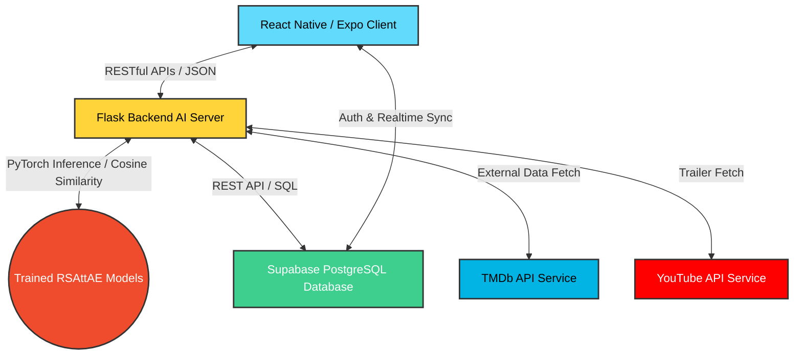

# CHƯƠNG 1. GIỚI THIỆU (INTRODUCTION)

## 1.1. Lý do chọn đề tài (Motivation)

### 1.1.1. Bối cảnh chuyển đổi số trong lĩnh vực giải trí điện ảnh và dịch vụ OTT
Trong bối cảnh cuộc Cách mạng Công nghiệp lần thứ tư (Cách mạng 4.0) đang diễn ra mạnh mẽ trên phạm vi toàn cầu, chuyển đổi số đã trở thành xu thế tất yếu, tác động sâu sắc đến mọi ngành nghề và lĩnh vực trong đời sống xã hội. Lĩnh vực giải trí truyền hình và điện ảnh không nằm ngoài làn sóng này. Phương thức tiếp cận và tiêu thụ nội dung của người dùng đã dịch chuyển căn bản từ các loại hình truyền thống như rạp chiếu phim vật lý, băng đĩa DVD, hay truyền hình cáp định kỳ sang các dịch vụ truyền thông trực tiếp trên Internet hay còn gọi là OTT (Over-The-Top).

Sự xuất hiện và lớn mạnh của các nền tảng xuyên quốc gia như Netflix, Disney+, Amazon Prime Video, Apple TV+ cùng các đơn vị cung cấp dịch vụ OTT nội địa hàng đầu tại Việt Nam như VieON, FPT Play, Galaxy Play, Clip TV đã tạo nên một thị trường vô cùng sôi động. Theo các báo cáo thống kê thị trường, quy mô người dùng dịch vụ OTT tại Việt Nam tăng trưởng liên tục với tốc độ hai chữ số mỗi năm. Sự thay đổi này không chỉ mang lại cho người dùng khả năng tiếp cận kho phim khổng lồ gồm hàng trăm nghìn tác phẩm từ khắp nơi trên thế giới vào bất kỳ thời điểm nào, mà còn tạo ra sự cạnh tranh khốc liệt giữa các nhà cung cấp dịch vụ trong việc nâng cao chất lượng trải nghiệm người dùng nhằm duy trì và phát triển thị phần.

### 1.1.2. Thách thức quá tải thông tin và nghịch lý của sự lựa chọn
Tuy nhiên, sự phong phú quá mức của các kho nội dung số lại vô tình đặt ra một thách thức lớn đối với người dùng cuối, được giới khoa học hành vi và kinh tế học gọi là **Hiện tượng quá tải thông tin (Information Overload)** và **Nghịch lý của sự lựa chọn (Paradox of Choice)**. Khi đối mặt với một danh mục chứa hàng nghìn bộ phim được trình bày tràn lan, bộ não con người có xu hướng bị quá tải trong việc xử lý thông tin để đưa ra quyết định. Thực tế chỉ ra rằng, trung bình một người dùng mất từ 15 đến 30 phút lướt qua các danh mục thể loại, tìm kiếm một cách ngẫu nhiên nhưng vẫn không lựa chọn được bộ phim ưng ý, dẫn đến cảm giác mệt mỏi, chán nản và thậm chí là rời bỏ ứng dụng (churn).

Từ phía các nhà vận hành ứng dụng giải trí, việc hiển thị thông tin không phù hợp hoặc không đúng thời điểm sẽ khiến các tài nguyên nội dung đắt giá (bản quyền phim) bị lãng quên dưới đáy kho dữ liệu (vấn đề "Long Tail" - đuôi dài). Do đó, nhu cầu lọc và định hướng nội dung phù hợp với từng cá nhân một cách tự động, thông minh đã trở thành bài toán sống còn đối với sự phát triển lâu dài của các nền tảng giải trí trực tuyến.

### 1.1.3. Hạn chế của các phương pháp lọc cộng tác truyền thống
Để giải quyết bài toán gợi ý phim, nhiều kỹ thuật xây dựng Hệ gợi ý (Recommendation Systems - RS) đã được nghiên cứu và áp dụng. Trong đó, Lọc cộng tác (Collaborative Filtering - CF) và Lọc dựa trên nội dung (Content-Based Filtering - CB) là các hướng tiếp cận kinh điển nhất. Tuy nhiên, khi đối mặt với dữ liệu thực tế quy mô lớn, các phương pháp này bộc lộ những hạn chế kỹ thuật rõ rệt:
1.  **Vấn đề dữ liệu thưa thớt (Data Sparsity):** Trong thực tế, một người dùng chỉ có thể xem và đánh giá một tỷ lệ rất nhỏ trên tổng số hàng nghìn bộ phim có sẵn (độ thưa thớt ma trận thường vượt quá 93% đến 99%). Các phương pháp lọc cộng tác truyền thống như k-Nearest Neighbors (k-NN) hay Phân rã ma trận cổ điển (Matrix Factorization - MF như SVD) gặp khó khăn lớn trong việc tính toán độ tương đồng hoặc học các vector ẩn khi số lượng đánh giá quá ít, dẫn đến suy giảm nghiêm trọng độ chính xác của gợi ý.
2.  **Vấn đề khởi đầu lạnh (Cold-Start Problem):** Đây là điểm yếu chí mạng của hệ thống gợi ý. Khi một người dùng mới đăng ký tài khoản (User Cold-Start) hoặc một bộ phim mới được đưa lên hệ thống (Item Cold-Start), hệ thống hoàn toàn chưa có dữ liệu đánh giá hay lịch sử tương tác của họ. Lọc cộng tác truyền thống gần như không thể đưa ra bất kỳ đề xuất nào ngoài các danh sách phim phổ biến nhất một cách cào bằng, gây thất vọng cho người dùng trong những trải nghiệm đầu tiên.
3.  **Khả năng học các mối quan hệ phi tuyến tính hạn chế:** Các phương pháp phân rã ma trận tuyến tính chỉ có thể mô hình hóa mối quan hệ tuyến tính giữa người dùng và sản phẩm qua tích vô hướng của hai vector ẩn. Trong khi đó, hành vi và sở thích của con người vô cùng phức tạp, phụ thuộc vào nhiều yếu tố đan xen mang tính phi tuyến tính cao.

### 1.1.4. Vai trò của mạng Autoencoder và Cơ chế chú ý (Attention Mechanism)
Để khắc phục triệt để các hạn chế trên, xu hướng nghiên cứu hệ gợi ý trong những năm gần đây đã dịch chuyển mạnh mẽ sang các kiến trúc Học sâu (Deep Learning). Trong số đó, sự kết hợp giữa **Mạng tự mã hóa Autoencoder (AE)** và **Cơ chế chú ý (Attention Mechanism)** đang là mũi nhọn công nghệ mang lại hiệu quả vượt trội:
*   **Mạng Autoencoder (AE):** Hoạt động theo nguyên lý nén đầu vào thưa thớt thành một vector đại diện có số chiều thấp hơn trong không gian ẩn (Latent Space) thông qua bộ mã hóa (Encoder), sau đó tái cấu trúc lại toàn bộ ma trận đầu vào thông qua bộ giải mã (Decoder). Quá trình này giúp hệ thống tự động điền các giá trị đánh giá còn thiếu (dự đoán rating) một cách hiệu quả ngay cả khi ma trận đầu vào cực kỳ thưa thớt.
*   **Cơ chế chú ý (Attention Mechanism):** Cho phép mô hình học cách phân bổ trọng số chú ý khác nhau vào các đặc trưng đầu vào tùy thuộc vào ngữ cảnh. Khi tích hợp cơ chế chú ý, mô hình có thể chủ động đánh giá tầm quan trọng của các thông tin phụ (Side Information) đi kèm như: thông tin nhân khẩu học của người dùng (tuổi, giới tính, nghề nghiệp) và các đặc trưng thuộc tính của bộ phim (thể loại, năm phát hành). Điều này giúp cải thiện đáng kể chất lượng biểu diễn vector ẩn, giải quyết hiệu quả bài toán Cold-Start bằng cách tìm kiếm sự tương đồng về hành vi thông qua các thuộc tính phụ khi chưa có lịch sử tương tác.

Nhận thức được tiềm năng to lớn của các công nghệ này cùng với mong muốn giải quyết một bài toán thực tế có tính ứng dụng cao, đề tài **"Xây dựng ứng dụng xem phim tích hợp tính năng gợi ý phim"** đã được lựa chọn để thực hiện đồ án tốt nghiệp. Đề tài tập trung nghiên cứu xây dựng một ứng dụng xem phim hoàn chỉnh (TKFilm), song song với việc nghiên cứu phát triển và tích hợp tính năng gợi ý phim thông qua mô hình học sâu **RSAttAE (Information-Aware Attention Autoencoder)** vào hệ thống nhằm mang lại trải nghiệm giải trí và khám phá nội dung thời gian thực tối ưu nhất cho người dùng.

---

## 1.2. Mục tiêu đề tài (Objectives & Contributions)

### 1.2.1. Mục tiêu tổng quát
Mục tiêu tổng quát của đề tài **"Xây dựng ứng dụng xem phim tích hợp tính năng gợi ý phim"** là phát triển thành công một sản phẩm phần mềm hoàn chỉnh bao gồm ứng dụng di động đa nền tảng (TKFilm) dùng để duyệt và quản lý thông tin phim, kết nối chặt chẽ với hệ thống dịch vụ Backend AI chạy suy luận thời gian thực để cung cấp tính năng gợi ý phim cá nhân hóa dựa trên mô hình Attention Autoencoder (RSAttAE), hướng tới khả năng ứng dụng thực tế cao và mở ra cơ hội kinh doanh số.

### 1.2.2. Mục tiêu cụ thể
Để đạt được mục tiêu tổng quát nêu trên, đề tài đề ra các mục tiêu cụ thể cần hoàn thành như sau:
1.  **Nghiên cứu lý thuyết và thuật toán hệ gợi ý:**
    *   Tìm hiểu tổng quan về các kiến trúc hệ gợi ý hiện đại trên thế giới.
    *   Nghiên cứu sâu mô hình toán học của mạng nơ-ron tự mã hóa (Autoencoder) ứng dụng trong lọc cộng tác.
    *   Nghiên cứu cơ chế chú ý (Attention Mechanism) kết hợp thông tin phụ (Side Information) để cải thiện độ chính xác biểu diễn vector ẩn.
2.  **Huấn luyện và tối ưu hóa mô hình AI (RSAttAE):**
    *   Khai thác tập dữ liệu chuẩn học thuật MovieLens 100K (943 người dùng, 1682 phim, 100.000 đánh giá) để huấn luyện hai mô hình riêng biệt: **User Attention Autoencoder** (học vector đặc trưng của người dùng) và **Movie Attention Autoencoder** (học vector đặc trưng của phim) với chiều ẩn kích thước $d=64$ và tỷ lệ loại bỏ nơ-ron ngẫu nhiên (Dropout) tối ưu $0.5$.
    *   Tích hợp thành công 23 đặc trưng phụ của phim (4 nhóm khoảng năm phát hành và 19 thể loại phim) và các đặc trưng nhân khẩu học của người dùng vào lớp Attention để tăng cường chất lượng nhúng (embeddings).
3.  **Thiết kế và xây dựng kiến trúc hệ thống Client-Server phân tách:**
    *   **Frontend di động (React Native/Expo):** Xây dựng giao diện ứng dụng di động cao cấp, trực quan với chế độ tối chủ đạo (Dark Mode), sử dụng các hiệu ứng thị giác hiện đại (Glassmorphism, mờ góc, chuyển động mượt mà). Tích hợp luồng Onboarding thông minh yêu cầu người dùng mới đánh giá tối thiểu 5 phim để giải quyết bài toán khởi đầu lạnh tức thời.
    *   **Backend AI & Service (Flask/Python):** Thiết kế API RESTful hiệu năng cao để tiếp nhận các yêu cầu gợi ý từ Client, truy vấn thông tin người dùng từ cơ sở dữ liệu, thực hiện tính toán độ tương đồng Cosine giữa vector người dùng và các vector phim để trả về danh sách đề xuất trong thời gian thực.
    *   **Cơ sở dữ liệu (Supabase):** Thiết lập cơ sở dữ liệu PostgreSQL Cloud trên nền tảng Supabase, thiết kế các bảng lưu trữ thông tin thực thể (người dùng, hồ sơ cá nhân, lịch sử xem phim, đánh giá phim thực tế) và áp dụng cơ chế phân quyền bảo mật cấp hàng (Row Level Security - RLS).
    *   **Tích hợp dịch vụ bên thứ ba:** Đồng bộ hóa dữ liệu thời gian thực với TMDb API để tải hình ảnh poster phim, tóm tắt nội dung cốt truyện và điểm số đánh giá toàn cầu; tích hợp YouTube API để tìm kiếm và phát trailer trực tuyến ngay trong ứng dụng.
4.  **Thử nghiệm, đánh giá và so sánh hiệu năng:**
    *   Thực hiện kiểm thử ngoại tuyến (Offline Evaluation) mô hình AI thông qua các chỉ số khoa học: Precision@K, Recall@K, NDCG@K (Normalized Discounted Cumulative Gain) và lỗi bình phương trung bình (MSE) trên tập dữ liệu kiểm thử độc lập.
    *   Đo lường thời gian phản hồi (Inference Latency) của Backend AI để đảm bảo độ trễ phản hồi dưới 100ms cho mỗi yêu cầu gợi ý từ thiết bị di động của người dùng.
    *   So sánh trực tiếp kết quả gợi ý của mô hình RSAttAE với các phương pháp Baseline phổ biến (Gợi ý ngẫu nhiên, Gợi ý theo độ phổ biến, Gợi ý lai ghép, mô hình XGBoost Recommender) nhằm chứng minh tính ưu việt của giải pháp được đề xuất.
5.  **Đề xuất mô hình kinh doanh khởi nghiệp:**
    *   Nghiên cứu khả năng mở rộng sản phẩm thành một giải pháp phần mềm dịch vụ B2B (Recommendation-as-a-Service - RaaS) hoặc ứng dụng B2C kết hợp mạng xã hội đánh giá điện ảnh (tương tự mô hình Letterboxd).

### 1.2.3. Đóng góp của đề tài
*   **Về mặt học thuật:** Minh chứng khả năng kết hợp thành công cơ chế chú ý (Attention Mechanism) và cấu trúc Autoencoder để xử lý dữ liệu thưa thớt và nâng cao chất lượng biểu diễn vector người dùng/sản phẩm trong hệ gợi ý.
*   **Về mặt thực tiễn:** Cung cấp một sản phẩm ứng dụng di động hoàn chỉnh có mức độ hoàn thiện cao, giao diện người dùng bắt mắt, hoạt động ổn định và sẵn sàng triển khai thực tế trên các nền tảng phân phối ứng dụng di động (Google Play Store, Apple App Store).

---

## 1.3. Đối tượng và Phạm vi đề tài (Scopes)

### 1.3.1. Đối tượng nghiên cứu
*   **Đối tượng lý thuyết:** Các thuật toán lọc cộng tác (Collaborative Filtering), mạng nơ-ron tự mã hóa (Autoencoder) sâu, cơ chế chú ý tự động (Self-Attention, Information-Aware Attention), các kỹ thuật xử lý ma trận thưa thớt, các phương pháp đánh giá hệ gợi ý (Ranking Metrics).
*   **Đối tượng hệ thống:** Quy trình xử lý dữ liệu từ nguồn gốc MovieLens 100K; thiết kế cơ sở dữ liệu quan hệ PostgreSQL; cơ chế đồng bộ hóa API RESTful giữa client di động và máy chủ suy luận học máy.

### 1.3.2. Đối tượng sử dụng hệ thống
Hệ thống TKFilm hướng tới hai nhóm đối tượng sử dụng chính với các quyền hạn và giao diện chuyên biệt:
1.  **Người xem phim (End-User):** Là đối tượng phục vụ cốt lõi của ứng dụng. Nhóm này sử dụng ứng dụng di động để duyệt danh sách phim đề xuất, tìm kiếm phim, xem thông tin chi tiết (trailers, mô tả thể loại, diễn viên), thực hiện đánh giá rating phim từ 1 đến 5 sao, lưu lịch sử xem phim và quản lý hồ sơ cá nhân.
2.  **Quản trị viên hệ thống (Administrator):** Sử dụng các tính năng nâng cao trên ứng dụng (giao diện Admin chuyên biệt) để quản lý danh mục phim, ẩn hoặc hiện các bộ phim vi phạm chính sách hoặc lỗi bản quyền, giám sát hoạt động đánh giá của các thành viên trên hệ thống và theo dõi các báo cáo hoạt động chung.

### 1.3.3. Phạm vi công nghệ áp dụng
Đồ án lựa chọn và làm chủ một hệ sinh thái công nghệ đa dạng, hiện đại và phân tách rõ ràng trách nhiệm của từng thành phần:

*   **Công nghệ Frontend (Client App):**
    *   **React Native & Expo:** Cho phép viết mã nguồn một lần bằng ngôn ngữ JavaScript/TypeScript và biên dịch trực tiếp ra mã máy gốc của cả hai nền tảng Android và iOS, giúp tiết kiệm thời gian phát triển và đảm bảo hiệu năng tối ưu.
    *   **Expo Router:** Cơ chế định tuyến dựa trên cấu trúc file thư mục (File-based Routing) hiện đại giúp tổ chức mã nguồn rõ ràng, dễ bảo trì và tối ưu hóa việc quản lý luồng điều hướng màn hình.
    *   **Zustand:** Thư viện quản lý trạng thái (State Management) gọn nhẹ nhưng cực kỳ mạnh mẽ, thay thế cho Redux cồng kềnh để lưu trữ các thông tin phiên đăng nhập, tùy chọn người dùng và đồng bộ hóa nhanh chóng giữa các màn hình.
*   **Công nghệ Backend (Server-Side):**
    *   **Flask Framework (Python):** Python là ngôn ngữ tiêu chuẩn trong lĩnh vực Trí tuệ Nhân tạo và Học máy. Flask được lựa chọn nhờ cấu trúc tối giản (micro-framework), tốc độ xử lý nhanh, dễ cấu hình và tương thích hoàn hảo với các thư viện xử lý dữ liệu (Pandas, Numpy) và học sâu (PyTorch).
    *   **PyTorch:** Thư viện mã nguồn mở hàng đầu cho học sâu, được sử dụng để xây dựng kiến trúc mạng RSAttAE, thực hiện quá trình huấn luyện ngoại tuyến và tải mô hình đã lưu (`.pt` files) để tính toán nhúng vector trực tuyến khi có yêu cầu gợi ý từ client.
*   **Hạ tầng Cơ sở dữ liệu và Dịch vụ đám mây (Backend-as-a-Service):**
    *   **Supabase:** Nền tảng thay thế mã nguồn mở cho Firebase, sử dụng cơ sở dữ liệu quan hệ PostgreSQL mạnh mẽ. Supabase quản lý hệ thống xác thực người dùng (Authentication), quản lý bảng dữ liệu, và thực thi các chính sách bảo mật cấp hàng (Row Level Security - RLS) để ngăn chặn truy cập trái phép vào dữ liệu cá nhân của người dùng khác.
*   **Dịch vụ API bên thứ ba để làm giàu thông tin (Metadata Enrichment):**
    *   **The Movie Database (TMDb) API:** Cung cấp thông tin thực tế của phim (poster ảnh, mô tả nội dung cốt truyện bằng nhiều ngôn ngữ, ngày phát hành thực tế, điểm bình chọn cộng đồng).
    *   **YouTube Data API v3:** Được tích hợp để tự động lấy mã ID video trailer chính thức của phim, giúp người dùng xem trực tiếp trailer chất lượng cao ngay trên ứng dụng di động mà không cần thoát ra ứng dụng khác.

### 1.3.4. Giới hạn hệ thống
Để đảm bảo tính khả thi của đồ án tốt nghiệp trong khung thời gian quy định, hệ thống được thiết lập một số giới hạn kỹ thuật cụ thể:
1.  **Số lượng phim và người dùng:** Hệ thống gợi ý AI chạy trên tập nhúng cố định được học từ tập dữ liệu MovieLens 100K (gồm 943 người dùng và 1682 bộ phim). Các bộ phim được tạo mới bởi quản trị viên trên bảng dữ liệu Supabase sau này sẽ được phục vụ thông qua các cơ chế gợi ý dự phòng (Cold-start Hybrid/Content-based) thay vì tính toán trực tiếp qua không gian nhúng của Autoencoder nhằm bảo toàn tính đồng nhất của vector latent space mà không cần thực hiện huấn luyện lại liên tục (Retraining).
2.  **Tính năng streaming nội dung:** Ứng dụng di động chỉ hiển thị metadata phim, trailer phim từ YouTube và cho phép đánh giá, tương tác. Hệ thống không lưu trữ và phát trực tiếp các file video phim đầy đủ vì các lý do liên quan tới hạ tầng lưu trữ băng thông lớn và bản quyền sở hữu trí tuệ của các tác phẩm điện ảnh.

### 1.3.5. Môi trường phát triển và kiểm thử
*   **Hệ điều hành máy chủ phát triển:** Windows 11 / Ubuntu Server 22.04 LTS.
*   **Môi trường huấn luyện AI:** Python 3.10+ chạy trên GPU NVIDIA CUDA để tăng tốc độ huấn luyện mô hình Autoencoder.
*   **Môi trường chạy thử nghiệm Client:** Trình mô phỏng Android (Android Studio Virtual Device), iOS Simulator (Xcode) và thiết bị di động thật iPhone 13 / Samsung Galaxy S22 thông qua ứng dụng Expo Go.

---

## 1.4. Ý nghĩa thực tiễn và Định hướng phát triển

### 1.4.1. Ý nghĩa thực tiễn đối với người dùng cuối
Ứng dụng TKFilm cung cấp một giải pháp thiết thực giúp tối ưu hóa cuộc sống số của người tiêu dùng hiện đại. Bằng việc giảm thiểu tối đa thời gian lãng phí cho việc tìm kiếm phim một cách thủ công, ứng dụng giúp nâng cao chất lượng trải nghiệm giải trí, đem lại sự thoải mái cho người dùng. Khả năng cá nhân hóa thời gian thực đảm bảo hệ thống luôn nhạy bén với những thay đổi trong sở thích của người dùng; ví dụ, chỉ cần người dùng đánh giá cao một bộ phim hành động vừa xem, danh sách gợi ý trang chủ sẽ lập tức thích ứng và đề xuất các tác phẩm tương tự ở lượt truy cập tiếp theo.

### 1.4.2. Khả năng triển khai trong các hệ thống doanh nghiệp thực tế
Với kiến trúc phân tách rõ ràng giữa giao diện Client và dịch vụ Backend gợi ý thông qua API RESTful chuẩn hóa, mô hình gợi ý RSAttAE của đề tài có khả năng ứng dụng thực tế rất cao. Các doanh nghiệp đang sở hữu các trang web phim trực tuyến hoặc ứng dụng truyền hình thông minh có thể dễ dàng tích hợp API gợi ý của TKFilm vào hệ thống sẵn có của họ mà không cần tái cấu trúc lại toàn bộ phần mềm. Máy chủ Flask AI có thể hoạt động độc lập, nhận thông tin đầu vào là lịch sử tương tác của người dùng qua yêu cầu HTTP POST và trả về danh sách ID phim đề xuất dưới dạng JSON chỉ trong vài mili giây. điều này giúp giảm đáng kể chi phí đầu tư nghiên cứu R&D cho các doanh nghiệp vừa và nhỏ trong nước.

### 1.4.3. Khả năng mở rộng dự án khởi nghiệp (Startup)
Đề tài mở ra nhiều hướng phát triển tiềm năng hướng tới xây dựng một mô hình khởi nghiệp công nghệ thực tế:
1.  **Phát triển mô hình kinh doanh B2B (Recommendation-as-a-Service - RaaS):** Cung cấp giải pháp gợi ý cá nhân hóa dưới dạng dịch vụ API tính phí thuê bao hàng tháng cho các website thương mại điện tử, các trang web tin tức, và các nền tảng xem video quy mô nhỏ cần thuật toán cá nhân hóa để tăng tỷ lệ chuyển đổi.
2.  **Phát triển mô hình B2C (Mạng xã hội điện ảnh cá nhân hóa):** Phát triển TKFilm thành một mạng xã hội kết nối những người yêu điện ảnh (tương tự Letterboxd nhưng có sự hỗ trợ đắc lực của mô hình AI gợi ý thay vì chỉ dựa vào đề xuất thủ công từ bạn bè). Hệ thống có thể tạo nguồn thu từ quảng cáo hiển thị hướng đối tượng hoặc cung cấp các gói thành viên VIP (loại bỏ quảng cáo, xem các phân tích chi tiết về biểu đồ sở thích điện ảnh cá nhân hóa).
3.  **Khả năng mở rộng sang các lĩnh vực khác (Cross-domain Recommendation):** Kiến trúc Attention Autoencoder (RSAttAE) được xây dựng trong đồ án có tính tổng quát hóa cao. Chỉ cần thay thế tập dữ liệu MovieLens bằng dữ liệu mua sắm thương mại điện tử (e-commerce), dữ liệu nghe nhạc (Spotify), hay dữ liệu đọc sách (Goodreads), đồng thời định nghĩa lại các thuộc tính phụ (Side Information) tương ứng là hệ thống có thể lập tức chuyển đổi thành hệ thống gợi ý hàng hóa, âm nhạc hay sách báo chất lượng cao. điều này khẳng định giá trị thực tiễn to lớn và tầm nhìn dài hạn của đề tài nghiên cứu.
