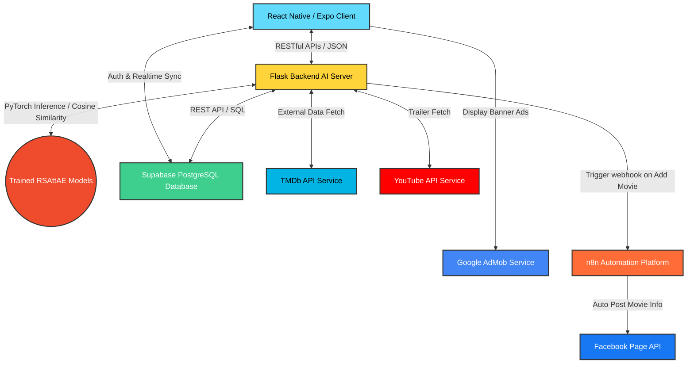

# CHƯƠNG 1. GIỚI THIỆU (INTRODUCTION)

## 1.1. Lý do chọn đề tài (Motivation)

### 1.1.1. Bối cảnh chuyển đổi số
Trong thời đại Cách mạng Công nghiệp 4.0 và xu hướng chuyển đổi số mạnh mẽ hiện nay, ngành công nghiệp giải trí trực tuyến đang chứng kiến bước chuyển mình chưa từng có. Thói quen tiếp cận và thưởng thức nghệ thuật điện ảnh của công chúng đã thay đổi hoàn toàn, dịch chuyển từ các rạp chiếu truyền thống hay kênh truyền hình cố định sang các nền tảng xem phim trực tuyến (Over-The-Top - OTT) trên môi trường di động và Internet [19]. Sự bùng nổ của các ứng dụng này tạo ra một lượng thông tin và sản phẩm số cực kỳ đồ sộ, yêu cầu các nhà phát triển phải liên tục nâng cao tính trải nghiệm, kết nối và tự động hóa hệ thống để thích ứng với làn sóng công nghệ mới.

### 1.1.2. Vấn đề thực tiễn tồn tại
Tuy nhiên, sự phong phú quá mức của các kho nội dung trực tuyến lại tạo ra hiện tượng **"quá tải thông tin" (Information Overload)** và **"nghịch lý lựa chọn" (Paradox of Choice)**. Người dùng thường xuyên rơi vào trạng thái bối rối, mất quá nhiều thời gian duyệt tìm phim mà không chọn được nội dung ưng ý [1], [2]. 

Bên cạnh đó, các nhà cung cấp nội dung còn đối mặt với ba vấn đề lớn:
1.  **Vấn đề khởi đầu lạnh (Cold-Start Problem)** và dữ liệu thưa thớt của các hệ gợi ý truyền thống khiến người dùng mới dễ rời bỏ ứng dụng [3], [4]. Khi người dùng hoặc sản phẩm mới gia nhập hệ thống, việc thiếu hụt lịch sử tương tác khiến thuật toán không thể tính toán chính xác sở thích cá nhân. Hạn chế này dẫn đến việc gợi ý không phù hợp, trực tiếp làm giảm trải nghiệm ban đầu và gia tăng tỷ lệ rời bỏ dịch vụ của khách hàng.
2.  **Thiếu tính tự động hóa trong truyền thông tiếp thị (Marketing Automation):** Việc cập nhật phim mới lên hệ thống và quảng bá thủ công lên các trang mạng xã hội (như Facebook) tiêu tốn nhiều thời gian và công sức của quản trị viên. Quy trình đẩy thông tin thủ công này thường gây ra sự trễ nải trong việc tiếp cận khán giả mục tiêu khi có nội dung mới xuất hiện. Sự thiếu đồng bộ giữa cơ sở dữ liệu nội bộ và các kênh mạng xã hội bên ngoài cũng trực tiếp làm giảm hiệu quả truyền thông của nền tảng.
3.  **Khó khăn trong việc duy trì doanh thu:** Các ứng dụng miễn phí hoặc đang trong giai đoạn phát triển ban đầu (MVP) rất khó tìm kiếm doanh thu để duy trì chi phí máy chủ và vận hành nếu không tích hợp các giải pháp quảng cáo thông minh. Việc áp dụng mô hình thu phí thuê bao trả trước thường tạo ra rào cản gia nhập rất lớn đối với tệp người dùng thử nghiệm ban đầu. Vì vậy, việc thiết lập một mô hình quảng cáo tích hợp khéo léo là giải pháp tối ưu giúp cân bằng giữa trải nghiệm người dùng và nguồn thu nhập ổn định cho nhà phát triển.

### 1.1.3. Nhu cầu thị trường/ người dùng
*   **Về phía người dùng:** Cần một ứng dụng xem phim thông minh, đóng vai trò như một "trợ lý cá nhân" có khả năng thấu hiểu hành vi đánh giá, tự động gợi ý phim cá nhân hóa theo thời gian thực và cung cấp trải nghiệm giải trí miễn phí nhưng vẫn tiện lợi [23].
*   **Về phía nhà vận hành/ thị trường:** Cần một giải pháp quản lý phim khép kín, tự động đồng bộ hóa thông tin phim, tự động chia sẻ quảng bá lên mạng xã hội để thu hút người dùng mà không cần nhân lực thủ công, đồng thời tự động kiếm tiền thông qua hiển thị quảng cáo tương tác để tối ưu hóa nguồn thu nhập động [19].

### 1.1.4. Xu hướng công nghệ liên quan
Để giải quyết triệt để các nhu cầu thực tiễn nêu trên, đề tài hướng tới tích hợp ba trụ cột công nghệ bổ trợ lẫn nhau:
1.  **Trí tuệ nhân tạo (AI - Deep Learning) trong Hệ gợi ý:** Ứng dụng mô hình **Attention Autoencoder (RSAttAE)** kết hợp thông tin phụ (Side Information) của cả người dùng và phim nhằm dự đoán chính xác sở thích cá nhân, giải quyết bài toán khởi đầu lạnh [9], [10].
2.  **Tự động hóa luồng công việc (Workflow Automation) với n8n:** n8n là công cụ tự động hóa mạnh mẽ dưới dạng mã nguồn mở. Việc sử dụng n8n để lắng nghe webhook từ Backend khi có phim mới, tự động biên soạn nội dung và tự động đăng tải bài viết giới thiệu phim lên trang mạng xã hội (Facebook Page) giúp tối đa hóa hiệu quả Marketing tiếp cận người xem [16].
3.  **Quảng cáo di động với Google AdMob:** Tích hợp bộ công cụ quảng cáo di động hàng đầu của Google nhằm hiển thị quảng cáo biểu ngữ (Banner Ads) tương thích thích ứng (Anchored Adaptive Banner) một cách tự nhiên trong ứng dụng, tạo dòng tiền doanh thu bền vững cho sản phẩm [17].

---

## 1.2. Mục tiêu đề tài (Objectives & Contributions)

### 1.2.1. Mục tiêu tổng quát
Mục tiêu tổng quát của đề tài là nghiên cứu và xây dựng hoàn chỉnh một giải pháp/sản phẩm kỹ thuật có khả năng ứng dụng thực tế cao dưới dạng ứng dụng di động xem phim đa nền tảng mang tên **TKFilm**. Hệ thống hướng tới tối ưu hóa trải nghiệm người dùng cuối bằng việc tích hợp thuật toán học sâu **RSAttAE (Attention Autoencoder)** nhằm cá nhân hóa danh sách gợi ý phim theo thời gian thực, đồng thời giảm thiểu công sức quản trị nhờ luồng tự động hóa marketing (Marketing Automation) đẩy thông tin giới thiệu phim mới lên mạng xã hội Facebook thông qua công cụ **n8n**. Bên cạnh đó, dự án thiết lập định hướng thương mại hóa rõ ràng bằng cách tích hợp mạng lưới quảng cáo di động **Google AdMob**, giúp tạo ra nguồn doanh thu thụ động bền vững nhằm bù đắp chi phí vận hành máy chủ và duy trì sản phẩm lâu dài trong thực tế.

### 1.2.2. Mục tiêu cụ thể
1.  **Phân tích bài toán:** Nghiên cứu nhu cầu người dùng xem phim, khảo sát các giải pháp tương tự, xác định yêu cầu nghiệp vụ của ứng dụng và của quy trình tiếp thị tự động.
2.  **Thiết kế hệ thống:** Thiết kế kiến trúc Client-Server phân tách: Frontend di động (React Native/Expo) tương tác với Backend API (Flask/Python) chạy AI PyTorch, lưu trữ dữ liệu tại PostgreSQL Cloud (Supabase), tích hợp Google AdMob cho Client và cổng Webhook tự động hóa n8n cho Backend.
3.  **Xây dựng prototype/MVP:**
    *   Phát triển giao diện di động TKFilm tối giản, sang trọng (Glassmorphism, Dark Theme).
    *   Tích hợp luồng Onboarding đánh giá nhanh phim để tạo vector nhúng người dùng ban đầu.
    *   Huấn luyện và tích hợp mô hình **User & Movie Attention Autoencoder** để chạy gợi ý thời gian thực.
    *   Xây dựng kịch bản tự động hóa **n8n** tự động đăng bài lên Facebook Page khi admin thêm phim mới.
    *   Tích hợp quảng cáo **Google AdMob Banner** vào ứng dụng để hiển thị quảng cáo thương mại.
4.  **Đánh giá hiệu quả:**
    *   Đo lường độ chính xác thuật toán gợi ý AI thông qua Precision@K, Recall@K, NDCG@K trên tập dữ liệu MovieLens 100K.
    *   Kiểm tra tính ổn định của luồng đẩy Webhook tự động qua n8n và tỷ lệ hiển thị thành công quảng cáo AdMob trên thiết bị di động.
    *   Kiểm tra tốc độ suy luận của mô hình đảm bảo thời gian phản hồi API dưới 100ms.
5.  **Đề xuất mô hình kinh doanh:** Phác thảo chiến lược kiếm tiền từ sản phẩm (Monetization Strategy) dựa trên doanh thu quảng cáo AdMob (mô hình quảng cáo) kết hợp mô hình SaaS/RaaS (Recommendation-as-a-Service) chuyển giao công nghệ cho đối tác doanh nghiệp.

---

## 1.3. Đối tượng và Phạm vi đề tài (Scopes)

### 1.3.1. Đối tượng người dùng mục tiêu (Target Audience)
Ứng dụng di động **TKFilm** hướng đến nhóm đối tượng người dùng cuối (B2C) và doanh nghiệp (B2B) có các đặc điểm nhân khẩu học và hành vi tiêu dùng nội dung cụ thể như sau:
*   **Nhân khẩu học (Demographics):** 
    *   **Độ tuổi:** Tập trung vào phân khúc trẻ tuổi từ 15 đến 35 tuổi (học sinh, sinh viên và nhân viên văn phòng). Đây là lực lượng chính có tần suất sử dụng điện thoại di động thông minh cực kỳ cao cho mục đích giải trí và xem phim trực tuyến hàng ngày.
    *   **Nghề nghiệp:** Học sinh, sinh viên và giới văn phòng – những người có nhu cầu giải trí cao sau những giờ làm việc, học tập căng thẳng nhưng quỹ thời gian rảnh rỗi hạn chế, cần các quyết định nhanh chóng.
*   **Hành vi và tâm lý tiêu dùng (Behavioral & Psychographics):**
    *   **Đam mê điện ảnh:** Những người có thói quen xem phim trực tuyến thường xuyên, có nhu cầu theo dõi thông tin phim, xem trailer và tham gia thảo luận cùng cộng đồng.
    *   **Gặp khó khăn do "quá tải thông tin":** Người xem thường bối rối trước hàng ngàn lựa chọn trên mạng, mong muốn có một "trợ lý thông minh" tự động gợi ý những bộ phim hợp gu mà không cần mất thời gian tìm kiếm thủ công.
    *   **Thích trải nghiệm miễn phí và cá nhân hóa:** Sẵn sàng tiếp nhận các biểu ngữ quảng cáo không quá phiền toái (Google AdMob) để đổi lấy việc sử dụng ứng dụng chất lượng cao hoàn toàn miễn phí và được cá nhân hóa sâu sắc theo sở thích.
*   **Đối tượng doanh nghiệp/đối tác (B2B - Phân khúc chuyển giao):**
    *   Các nhà vận hành website phim vừa và nhỏ, các fanpage cộng đồng điện ảnh muốn tối ưu hóa quy trình tiếp thị tự động và tích hợp tính năng gợi ý thông minh thời gian thực để thu hút độc giả.

### 1.3.2. Phạm vi công nghệ
Kiến trúc hệ thống của đề tài làm chủ và vận hành các công nghệ hiện đại sau:

*   **Frontend (Ứng dụng di động):** React Native, bộ công cụ Expo, định tuyến Expo Router, quản lý trạng thái Zustand, và thư viện `react-native-google-mobile-ads` để tích hợp quảng cáo di động Google AdMob.
*   **Backend AI & Service:** Flask Framework (Python), thư viện học sâu PyTorch chạy suy luận từ các mô hình nhúng nơ-ron đã lưu (`.pt` files).
*   **Tự động hóa & Mạng xã hội:** Nền tảng tự động hóa **n8n** (lắng nghe webhook của máy chủ Flask qua HTTP POST để tự động gọi Facebook Graph API nhằm đăng tải bài viết lên trang fanpage).
*   **Công nghệ ảo hóa và đóng gói:** Docker & Docker Compose được sử dụng để đóng gói và vận hành độc lập hệ thống máy chủ n8n (n8n container), giúp cô lập môi trường chạy và dễ dàng triển khai.
*   **Cơ sở dữ liệu đám mây:** Supabase (PostgreSQL Cloud) quản lý cơ sở dữ liệu quan hệ, xác thực người dùng và phân quyền RLS.
*   **Dịch vụ API bên thứ ba:** TMDb API (đồng bộ hóa nội dung cốt truyện và ảnh poster phim) và YouTube Data API v3 (tải trailer video trực tuyến).

### 1.3.3. Giới hạn hệ thống
1.  **Dữ liệu nhúng của mô hình gợi ý:** Thuật toán gợi ý chính (RSAttAE) chạy trên tập nhúng được huấn luyện cố định từ tập dữ liệu tiêu chuẩn MovieLens 100K gồm 943 người dùng và 1682 bộ phim. Các phim mới do quản trị viên thêm vào cơ sở dữ liệu sẽ tạm thời được gợi ý thông qua giải pháp lai ghép (Hybrid/Content-based) dựa trên các thuộc tính thể loại phim (Genres) sẵn có. Cơ chế này sẽ được duy trì để giải quyết bài toán khởi đầu lạnh cho đến khi hệ thống thực hiện chu kỳ huấn luyện lại (Retraining) định kỳ nhằm cập nhật toàn bộ ma trận nhúng của thực thể.
2.  **Streaming nội dung phim:** Hệ thống chỉ hỗ trợ phát các đoạn video giới thiệu ngắn (trailer) của phim từ nguồn chia sẻ của YouTube thông qua thư viện trình phát tích hợp sẵn trên ứng dụng di động. Sản phẩm hoàn toàn không cung cấp tính năng truyền tải và phát trực tiếp (streaming) các bộ phim dài đầy đủ bản quyền do những giới hạn khắt khe về mặt chi phí máy chủ và bản quyền truyền thông số. Mục tiêu cốt lõi của tính năng này là cung cấp nội dung xem trước nhanh chóng nhằm kích thích hành vi tương tác và đánh giá điểm số của người dùng phục vụ cho việc cập nhật sở thích.
3.  **Vận hành quảng cáo AdMob:** Trong giai đoạn phát triển và kiểm thử sản phẩm tối thiểu (MVP), quảng cáo chỉ được cấu hình hiển thị thông qua tài khoản kiểm thử và các mã ID quảng cáo demo do Google AdMob cung cấp. Điều này giúp nhóm phát triển xác thực toàn bộ luồng hoạt động, vị trí hiển thị và cơ chế gọi API quảng cáo thích ứng một cách an toàn và tuân thủ đúng chính sách của nhà phát triển. Việc đăng ký tài khoản đối tác chính thức và cấu hình các mã ID thương mại thực tế sẽ chỉ được thực hiện sau khi ứng dụng được đưa lên các cửa hàng phân phối ứng dụng chính thống.

### 1.3.4. Môi trường triển khai
*   **Máy chủ Backend Flask và mô hình AI:** Các dịch vụ API Backend và mô hình học sâu phục vụ suy luận được khởi chạy chủ yếu trên môi trường máy chủ cục bộ (Local Host) trong quá trình phát triển thử nghiệm ban đầu. Bên cạnh đó, hệ thống cũng hỗ trợ cấu hình chạy trên môi trường container hóa thông qua Docker để dễ dàng quản lý và cô lập tài nguyên hệ thống. Cách tiếp cận này giúp đảm bảo sự đồng bộ tối đa về môi trường hoạt động của mã nguồn Python cũng như các thư viện phụ thuộc của PyTorch.
*   **Môi trường tự động hóa n8n:** Hệ thống tự động hóa n8n được thiết lập theo mô hình tự lưu trữ (Self-hosted) thông qua việc chạy một container n8n độc lập trên nền tảng ảo hóa Docker. Container này đóng vai trò là một dịch vụ lắng nghe (listener) thường trực để tiếp nhận payload webhook gửi từ máy chủ Flask khi có phim mới. Ngay khi có tín hiệu, quy trình công việc (workflow) bên trong n8n sẽ tự động kích hoạt các yêu cầu gọi Facebook Graph API để hoàn tất việc đăng tải bài viết quảng bá phim.
*   **Hồ sơ cơ sở dữ liệu:** Hệ thống cơ sở dữ liệu quan hệ PostgreSQL của dự án được triển khai trực tiếp trên nền tảng dịch vụ đám mây của Supabase Cloud. Dịch vụ này giúp giảm thiểu tối đa gánh nặng về thiết lập phần cứng vật lý cũng như công sức bảo trì hạ tầng lưu trữ. Ngoài ra, việc lưu trữ đám mây còn đảm bảo khả năng đồng bộ dữ liệu thời gian thực và cho phép cấu hình các chính sách bảo mật cấp hàng (RLS) trực tiếp trên đám mây.
*   **Ứng dụng Client di động:** Ứng dụng Client di động được triển khai chạy thử nghiệm trực tiếp trên cả các thiết bị di động vật lý (sử dụng hệ điều hành Android và iOS) và các phần mềm giả lập điện thoại trên máy tính. Việc chạy ứng dụng trên nhiều môi trường giả lập khác nhau giúp đảm bảo giao diện luôn hiển thị chính xác và nhất quán. Toàn bộ quá trình biên dịch và khởi chạy này được hỗ trợ tối đa bởi công cụ Expo Go, giúp đơn giản hóa luồng xây dựng và kiểm thử ứng dụng đa nền tảng.

---

## 1.4. Ý nghĩa thực tiễn

### 1.4.1. Giải quyết vấn đề thực tế
*   **Tối ưu hóa trải nghiệm người dùng cuối:** Ứng dụng giúp người dùng giải quyết triệt để vấn đề quá tải thông tin nhờ thuật toán gợi ý cá nhân hóa thông minh. Thông qua các đề xuất chính xác, người xem có thể tìm thấy bộ phim phù hợp với sở thích cá nhân chỉ trong vài giây duyệt ứng dụng. Trải nghiệm mượt mà này giúp tối ưu hóa thời gian giải trí và tăng độ gắn kết lâu dài của người dùng đối với sản phẩm.
*   **Tự động hóa tiếp thị cho quản trị viên:** Quy trình truyền thông mạng xã hội cho quản trị viên được tự động hóa hoàn toàn nhờ sự hỗ trợ đắc lực từ nền tảng n8n. Giải pháp này giúp tiết kiệm tối đa thời gian và công sức soạn thảo, đăng bài PR phim một cách thủ công như trước đây. Đồng thời, nó giúp nâng cao hiệu suất tiếp cận khách hàng tiềm năng và gia tăng tương tác tự nhiên trên các kênh truyền thông xã hội.
*   **Tạo dựng mô hình tài chính bền vững:** Việc tích hợp mạng lưới quảng cáo Google AdMob mang lại nguồn thu nhập thụ động hợp pháp và ổn định cho nhà phát hành. Dòng tiền doanh thu này đóng vai trò quan trọng giúp trang trải các chi phí vận hành máy chủ và bảo trì hệ thống định kỳ. Đây chính là cơ sở tài chính vững chắc để nhóm phát triển có thể tiếp tục tối ưu hóa, nâng cấp ứng dụng trong tương lai.

### 1.4.2. Khả năng triển khai
*   **Độ tin cậy và tính mô-đun hóa của kiến trúc:** Thiết kế kiến trúc dạng module độc lập giữa Client di động, Backend Flask và dịch vụ tự động hóa n8n giúp hệ thống hoạt động cực kỳ ổn định. Các phân hệ nghiệp vụ có thể được phát triển, kiểm thử và nâng cấp một cách riêng biệt mà không làm gián đoạn các dịch vụ khác. Sự phân tách rõ ràng này cũng giúp tối ưu hóa hiệu năng tổng thể và đơn giản hóa quá trình phát hiện cũng như sửa lỗi hệ thống.
*   **Khả năng tích hợp dịch vụ gợi ý linh hoạt:** Các cổng kết nối API RESTful được thiết kế và chuẩn hóa cao cho phép dễ dàng tích hợp dịch vụ gợi ý AI vào bất kỳ hệ thống nào khác. Nhờ đó, các doanh nghiệp kinh doanh nội dung số có thể nhanh chóng nâng cấp tính năng cá nhân hóa mà không cần xây dựng mô hình học sâu từ đầu. Khả năng tương thích linh hoạt này giúp giảm thiểu chi phí phát triển công nghệ cho đối tác và bảo vệ tính toàn vẹn của hệ thống sẵn có.

### 1.4.3. Khả năng mở rộng startup
*   **Mô hình kinh doanh B2B:** Ở mô hình B2B, dự án hướng tới chuyển giao công nghệ gợi ý dưới dạng dịch vụ API (Recommendation-as-a-Service - RaaS). Giải pháp này hỗ trợ các đơn vị phát hành phim trực tuyến quy mô vừa và nhỏ sở hữu năng lực cá nhân hóa nội dung mạnh mẽ. Qua đó, đối tác có thể nâng cao năng lực cạnh tranh sòng phẳng về trải nghiệm người dùng với các tập đoàn giải trí lớn toàn cầu.
*   **Mô hình kinh doanh B2C:** Đối với mô hình B2C, ứng dụng có thể định hướng phát triển trở thành một mạng xã hội đánh giá và thảo luận phim chuyên sâu. Mô hình kinh doanh sẽ kết hợp linh hoạt giữa nguồn doanh thu quảng cáo Google AdMob đa dạng và các gói dịch vụ nâng cao không quảng cáo. Hướng đi này giúp khai thác tối đa giá trị vòng đời của người dùng và đa dạng hóa nguồn doanh thu cho sản phẩm.
*   **Khả năng mở rộng đa nền tảng và đa lĩnh vực:** Kịch bản tự động hóa trên n8n có khả năng mở rộng để tự động hóa đăng bài trên nhiều nền tảng mạng xã hội khác như Instagram, TikTok hay Telegram. Đồng thời, kiến trúc mô hình học sâu RSAttAE cũng dễ dàng được tái cấu hình để áp dụng cho các lĩnh vực thương mại điện tử tương tự. Tính linh hoạt của cả AI và luồng tự động hóa giúp giải pháp nhanh chóng thích ứng với nhiều sản phẩm và thị trường dịch vụ khác nhau.
