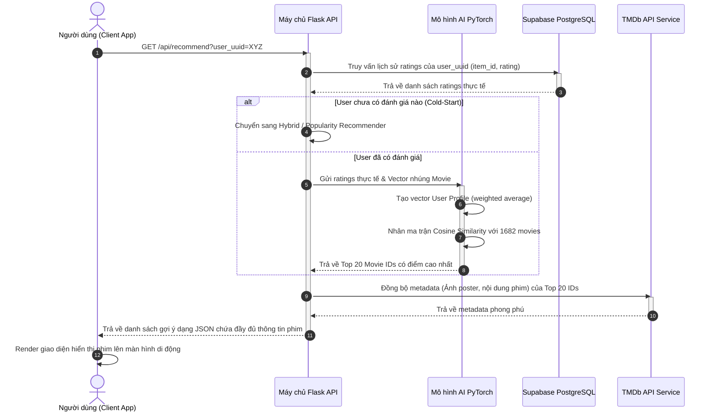
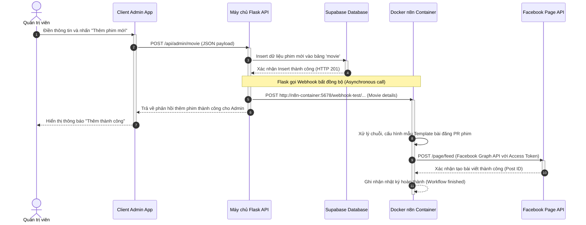

# CHƯƠNG 3. THIẾT KẾ VÀ PHÁT TRIỂN SẢN PHẨM (PRODUCT DESIGN AND DEVELOPMENT)

## 3.1. Kiến trúc hệ thống

### 3.1.1. Sơ đồ kiến trúc tổng quan (Architecture Overview)
Hệ thống **TKFilm** được thiết kế theo kiến trúc Client-Server phân tách ba lớp (Three-Tier Architecture), kết hợp với mô hình Microservices gọn nhẹ cho phần Backend AI và nền tảng tự động hóa công việc độc lập. Sự phân tách này giúp tối ưu hóa hiệu năng, tăng cường tính bảo mật và đảm bảo khả năng bảo trì độc lập giữa giao diện người dùng và thuật toán học máy.

Sơ đồ hoạt động tương tác vật lý giữa các thành phần của hệ thống bao gồm:
1.  **Lớp Giao diện (Presentation Layer - Client App):** Ứng dụng di động được phát triển bằng React Native & Expo [13], chạy trên thiết bị di động của người dùng. Lớp này chịu trách nhiệm hiển thị UI, thu thập tương tác (chạm, tìm kiếm, đánh giá của người dùng) và giao tiếp với Backend thông qua các truy vấn API RESTful bảo mật. Lớp này cũng tích hợp trực tiếp SDK quảng cáo **Google AdMob** để hiển thị banner quảng cáo động [17].
2.  **Lớp Dịch vụ và Trí tuệ Nhân tạo (Application/AI Layer - Backend Server):** Máy chủ Flask (Python) chạy độc lập đóng vai trò cổng kết nối API [14]. Nó tải các mô hình PyTorch đã được huấn luyện sẵn [10] và thực hiện tính toán độ tương đồng Cosine thời gian thực để tạo ra danh sách gợi ý. Khi nhận sự kiện thêm phim mới từ Admin, Backend cũng chịu trách nhiệm gửi một HTTP POST payload (Webhook) đến máy chủ tự động hóa.
3.  **Lớp Dữ liệu và Xác thực (Data Layer - Cloud Database):** Supabase PostgreSQL quản lý lưu trữ trạng thái lâu dài (Persistent Storage) của người dùng, đánh giá thực tế và lịch sử xem [15]. Supabase cũng phụ trách xác thực tài khoản qua giao thức JWT.
4.  **Lớp Tự động hóa truyền thông (Automation Layer - n8n):** Hệ thống tự động hóa n8n chạy trong Docker container [18], đóng vai trò nhận dữ liệu phim mới thông qua webhook [16] và gọi trực tiếp Facebook Graph API để tạo bài đăng truyền thông trên Fanpage điện ảnh [20].

---

### 3.1.2. Sơ đồ Use Case (Use Case Diagrams)
Sơ đồ Use Case định nghĩa các tương tác chính giữa tác nhân (Actor) và hệ thống:

```
                  +--------------------------------------------+
                  |                 HỆ THỐNG TKFILM            |
                  |                                            |
                  |  [ Đăng ký / Đăng nhập tài khoản ] <---+   |
                  |                                        |   |
                  |  [ Thực hiện đánh giá Onboarding ] <---+   |
                  |                                        |   |
                  |  [ Xem gợi ý phim cá nhân hóa ] <------+   |
  ((Người dùng)) -+  [ Xem chi tiết phim & Trailer ] <-----+   |
                  |  [ Đánh giá phim (1-5 sao) ] <---------+   |
                  |  [ Lưu và xem lịch sử xem phim ] <------+   |
                  |  [ Xem quảng cáo Google AdMob ]            |
                  |                                            |
                  |  [ Thêm phim mới vào hệ thống ] <------+   |
    ((Admin)) ----+  [ Ẩn / Hiện phim danh mục ] <---------+   |
                  |  [ Khóa / Mở khóa tài khoản ]              |
                  |                                            |
                  |  [ Tự động đăng bài lên Facebook ] <-------+  ===> (( Facebook API ))
                  +--------------------------------------------+
```

1.  **Tác nhân Người dùng (End-User):** Tác nhân chính (Primary Actor), tương tác trực tiếp với ứng dụng di động để đăng nhập tài khoản, thực hiện đánh giá sở thích Onboarding, duyệt xem gợi ý phim cá nhân hóa, xem trailer, viết bình luận và tương tác với quảng cáo.
2.  **Tác nhân Quản trị viên (Administrator):** Tác nhân chính (Primary Actor), tương tác với phân hệ quản trị để thêm phim mới vào cơ sở dữ liệu, quản lý hiển thị danh mục phim (ẩn/hiện phim) và khóa/mở khóa các tài khoản người dùng vi phạm.
3.  **Tác nhân hệ thống Facebook Graph API:** Tác nhân phụ (Secondary/System Actor), nhận tín hiệu tự động hóa từ phân hệ n8n để đăng tải bài viết PR giới thiệu phim mới lên Fanpage công khai của TKFilm.
4.  **Tác nhân hệ thống Google AdMob Service:** Tác nhân phụ (Secondary/System Actor), tiếp nhận yêu cầu từ ứng dụng di động để phân phối các quảng cáo biểu ngữ (Adaptive Banners) hiển thị trên màn hình người dùng, đồng thời xử lý số liệu doanh thu.

---

### 3.1.3. Sơ đồ tuần tự (Sequence Diagram)
Các sơ đồ tuần tự biểu diễn dòng tương tác thời gian thực giữa các thành phần trong hệ thống được trực quan hóa bằng công cụ vẽ biểu đồ Mermaid [21]:

#### A. Quy trình gợi ý phim cá nhân hóa thời gian thực (Real-time Recommendation Flow)
Quy trình biểu diễn trình tự các bước tương tác từ khi người dùng mở trang chủ cho đến khi danh sách phim được gợi ý hiển thị:


Hình 23. Sơ đồ tuần tự về Quy trình gợi ý phim cá nhân hóa thời gian thực

**Mô tả chi tiết các bước tương tác trong Quy trình gợi ý phim cá nhân hóa:**
*   **Bước 1:** Khi người dùng truy cập vào ứng dụng khách (Client App) và mở màn hình trang chủ, ứng dụng sẽ tự động kích hoạt một yêu cầu HTTP GET gửi đến API `/api/recommend?user_uuid=XYZ` trên máy chủ Flask để yêu cầu lấy danh sách phim gợi ý cá nhân hóa dành riêng cho người dùng này.
*   **Bước 2 - 3:** Máy chủ Flask tiếp nhận yêu cầu và gửi một câu lệnh truy vấn SQL tương ứng đến cơ sở dữ liệu Supabase PostgreSQL nhằm trích xuất lịch sử tương tác và điểm số đánh giá phim (`rating`) cùng mã định danh phim tương ứng (`item_id`) của người dùng có mã `user_uuid` chỉ định. Dữ liệu lịch sử đánh giá thực tế này sau đó được cơ sở dữ liệu trả về đầy đủ cho Flask.
*   **Bước 4 (Nhánh rẽ alt - Cold-Start):** Trong trường hợp người dùng mới đăng ký hệ thống và chưa thực hiện bất kỳ đánh giá phim nào trước đây (bài toán Khởi đầu lạnh - Cold-Start), máy chủ Flask sẽ tự động chuyển hướng xử lý sang mô hình lai ghép hoặc đề xuất danh sách phim phổ biến nhất (Popularity Recommender) để hiển thị.
*   **Bước 5 - 8 (Nhánh rẽ alt - Đã có đánh giá):** Ngược lại, nếu người dùng đã có lịch sử đánh giá trong hệ thống, Flask sẽ gửi danh sách các ratings thực tế của người dùng kèm theo ma trận vector nhúng của các bộ phim tương ứng sang phân hệ mô hình AI chạy trên thư viện PyTorch. Tại đây, mô hình PyTorch sẽ thực hiện các bước xử lý con:
    *   *Bước 6:* Tính toán và tạo vector đặc trưng sở thích người dùng (User Profile Vector) dựa trên trung bình cộng có trọng số (weighted average) của các vector nhúng của những bộ phim người dùng đã đánh giá.
    *   *Bước 7:* Thực hiện phép nhân ma trận để tính toán độ tương đồng Cosine (Cosine Similarity) giữa vector sở thích người dùng với toàn bộ vector của 1682 bộ phim trong không gian nhúng của hệ thống.
    *   *Bước 8:* Trích xuất và trả về cho máy chủ Flask danh sách mã của Top 20 bộ phim đạt điểm số tương đồng dự đoán cao nhất.
*   **Bước 9 - 10:** Sau khi nhận danh sách 20 mã phim gợi ý tối ưu, máy chủ Flask gửi yêu cầu đồng bộ hóa dữ liệu (bao gồm nội dung tóm tắt cốt truyện, ảnh poster độ phân giải cao và các siêu dữ liệu bổ sung) từ dịch vụ TMDb API Service bên thứ ba, sau đó nhận về cấu trúc metadata phong phú đã được chuẩn hóa.
*   **Bước 11 - 12:** Máy chủ Flask đóng gói toàn bộ danh sách 20 phim kèm theo metadata đầy đủ thành một chuỗi dữ liệu JSON và trả về phản hồi thành công cho ứng dụng khách. Thiết bị di động của người dùng nhận được dữ liệu JSON, tiến hành giải nén và render hiển thị giao diện danh sách phim gợi ý trực quan lên màn hình trang chủ.

#### B. Quy trình tự động hóa truyền thông (Automated Facebook Posting Flow)
Quy trình biểu diễn trình tự kích hoạt tự động đăng bài PR phim lên Facebook khi quản trị viên thực hiện cập nhật nội dung:


Hình 24. Sơ đồ tuần tự về Quy trình tự động hóa truyền thông (Automated Facebook Posting Flow)

**Mô tả chi tiết các bước tương tác trong Quy trình tự động hóa truyền thông:**
*   **Bước 1 - 2:** Quản trị viên tiến hành điền đầy đủ thông tin mô tả chi tiết của bộ phim mới (bao gồm tên phim, thể loại, tóm tắt cốt truyện, ảnh đại diện và link trailer) trên màn hình của ứng dụng quản trị Client Admin App, sau đó nhấn nút xác nhận "Thêm phim mới". Client Admin App gửi một yêu cầu HTTP POST mang payload định dạng JSON chứa dữ liệu phim mới tới endpoint `/api/admin/movie` trên máy chủ Flask API.
*   **Bước 3 - 4:** Máy chủ Flask API tiếp nhận yêu cầu và thực hiện câu lệnh Insert để lưu trữ dữ liệu phim mới vào bảng `movie` trong Supabase Database. Sau khi dữ liệu được ghi nhận thành công, cơ sở dữ liệu Supabase phản hồi mã HTTP 201 xác nhận thao tác hoàn tất.
*   **Bước 5:** Máy chủ Flask API thực hiện một lệnh gọi webhook bất đồng bộ gửi yêu cầu HTTP POST chứa siêu dữ liệu của phim mới sang container n8n chạy độc lập trên Docker để xử lý quy trình chia sẻ tự động.
*   **Bước 6 - 7:** Đồng thời với cuộc gọi webhook bất đồng bộ, Flask trả phản hồi thành công về cho Client Admin App. Giao diện ứng dụng di động phía quản trị viên hiển thị thông báo "Thêm thành công".
*   **Bước 8 - 10:** Tại phân hệ tự động hóa, container n8n tiếp nhận thông tin phim mới, thực hiện trích xuất dữ liệu, định dạng theo mẫu bài đăng PR được cấu hình sẵn. Sau đó, n8n gọi Graph API của Facebook (sử dụng OAuth 2.0 Access Token) để đăng tải bài viết lên trang Fanpage. Khi Facebook xác nhận đăng thành công và trả về Post ID, n8n hoàn thành quy trình và lưu vết lịch sử.

---

### 3.2.1. Thiết kế Cơ sở dữ liệu (Database Schema Design)

Cơ sở dữ liệu của hệ thống được tổ chức trên máy chủ đám mây Supabase PostgreSQL [15]. Dưới đây là thiết kế chi tiết cấu trúc các bảng vật lý:

#### A. Bảng hồ sơ người dùng (`public.profile`)
Lưu trữ thông tin chi tiết và quyền hạn của người dùng, liên kết trực tiếp với bảng xác thực người dùng gốc (`auth.users`) của hệ thống Supabase.

| Tên trường | Kiểu dữ liệu | Ràng buộc | Mô tả |
| :--- | :--- | :--- | :--- |
| `id` | `UUID` | PRIMARY KEY, REFERENCES `auth.users(id)` | Khóa chính liên kết trực tiếp với bảng xác thực tài khoản của Supabase Auth. |
| `name` | `TEXT` | NON-NULLABLE | Tên đầy đủ hoặc biệt danh hiển thị của người dùng trên ứng dụng. |
| `email` | `TEXT` | NON-NULLABLE | Địa chỉ thư điện tử dùng để liên lạc và nhận các thông báo từ hệ thống. |
| `gender` | `TEXT` | NULLABLE | Giới tính của người dùng (Nam/Nữ/Khác) phục vụ phân tích sở thích. |
| `job` | `TEXT` | NULLABLE | Nghề nghiệp hiện tại của người dùng hỗ trợ gợi ý phim theo đặc thù công việc. |
| `phone` | `TEXT` | NULLABLE | Số điện thoại liên kết dùng cho bảo mật tài khoản. |
| `role` | `TEXT` | DEFAULT 'user', NON-NULLABLE | Phân quyền tài khoản trong hệ thống (Ví dụ: `admin`, `user`). |
| `banned` | `BOOLEAN` | DEFAULT FALSE, NON-NULLABLE | Trạng thái khóa tài khoản của người dùng (nếu vi phạm quy định cộng đồng). |
| `created_at` | `TIMESTAMPTZ` | DEFAULT now(), NON-NULLABLE | Thời gian khởi tạo hồ sơ người dùng trên cơ sở dữ liệu. |

Hình 25. Cơ sở dữ liệu Bảng hồ sơ người dùng (public.profile).

Bảng `public.profile` chịu trách nhiệm lưu trữ và quản lý thông tin định danh chi tiết của từng người dùng trong hệ thống. Trường khóa chính `id` sử dụng kiểu dữ liệu `uuid` để đồng bộ trực tiếp với cơ chế xác thực tài khoản mặc định của Supabase Auth. Các thông tin cá nhân như tên hiển thị, địa chỉ email, giới tính, nghề nghiệp được thu thập và lưu trữ để hỗ trợ các phân tích hành vi sau này. Ngoài ra, bảng còn tích hợp trường phân quyền `role` để quản trị viên có thể kiểm soát quyền truy cập hệ thống và trường `banned` để thực hiện khóa tài khoản đối với những người dùng vi phạm chính sách cộng đồng.

---

#### B. Bảng danh mục phim (`public.movie`)
Lưu trữ thông tin thuộc tính của các bộ phim tương thích với chỉ mục nhúng của mô hình MovieLens.

| Tên trường | Kiểu dữ liệu | Ràng buộc | Mô tả |
| :--- | :--- | :--- | :--- |
| `movie_id` | `INT8` | PRIMARY KEY | Mã định danh duy nhất của bộ phim tương thích với ID trong tập dữ liệu MovieLens 100K. |
| `movie_title` | `TEXT` | NON-NULLABLE | Tiêu đề đầy đủ của bộ phim cùng năm sản xuất tương ứng. |
| `release_date` | `TEXT` | NULLABLE | Ngày phát hành chính thức của bộ phim ra rạp công chúng. |
| `video_release_date` | `TEXT` | NULLABLE | Ngày phát hành phiên bản video/đĩa của bộ phim. |
| `IMDb_URL` | `TEXT` | NULLABLE | Đường dẫn liên kết tới trang thông tin chi tiết phim trên hệ thống IMDb. |
| `created_at` | `TIMESTAMPTZ` | DEFAULT now(), NULLABLE | Thời gian bản ghi thông tin phim được khởi tạo trong hệ thống. |
| `Column6` đến `Column24` | `INT2` | DEFAULT 0, NON-NULLABLE | 19 trường dữ liệu nhị phân tương ứng với các thể loại phim khác nhau của MovieLens. |

> [!NOTE]
> Các trường từ `Column6` đến `Column24` biểu diễn 19 thể loại phim nhị phân của MovieLens 100K theo thứ tự cụ thể bao gồm: *unknown, Action, Adventure, Animation, Children's, Comedy, Crime, Documentary, Drama, Fantasy, Film-Noir, Horror, Musical, Mystery, Romance, Sci-Fi, Thriller, War, Western*. Các trường này đóng vai trò là thông tin bổ trợ (Side Information) cực kỳ quan trọng để mô hình học sâu Attention Autoencoder xây dựng không gian nhúng phim hiệu quả.

Hình 26. Cơ sở dữ liệu Bảng danh mục phim (public.movie).

Bảng `public.movie` đóng vai trò lưu trữ toàn bộ cơ sở dữ liệu danh mục phim được sử dụng trong hệ gợi ý cá nhân hóa của ứng dụng. Trường khóa chính `movie_id` đóng vai trò liên kết dữ liệu với mã định danh phim gốc trong tập dữ liệu chuẩn MovieLens 100K nhằm hỗ trợ quá trình huấn luyện mô hình. Tiêu đề phim và các siêu dữ liệu cơ bản như ngày phát hành hay liên kết IMDb được lưu giữ đầy đủ để thuận tiện cho việc hiển thị và đồng bộ. Đặc biệt, cấu trúc bảng tích hợp 19 trường dữ liệu nhị phân đại diện cho 19 thể loại phim khác nhau từ `Column6` đến `Column24` để làm đầu vào thông tin phụ trợ đặc trưng cho mạng nơ-ron tự mã hóa.

---

#### C. Bảng đánh giá phim (`public.rating`)
Lưu trữ các tương tác đánh giá điểm số của người dùng đối với các bộ phim cụ thể.

| Tên trường | Kiểu dữ liệu | Ràng buộc | Mô tả |
| :--- | :--- | :--- | :--- |
| `id` | `INT8` | PRIMARY KEY, GENERATED ALWAYS AS IDENTITY | Mã số định danh tự động tăng duy nhất cho từng bản ghi đánh giá phim. |
| `user_uuid` | `UUID` | FOREIGN KEY (references `profile.id`), NON-NULLABLE | Khóa ngoại liên kết với mã định danh tài khoản người dùng đăng nhập thực tế. |
| `user_id` | `INT4` | NON-NULLABLE | Mã số người dùng dạng số nguyên nhằm duy trì tính tương thích với định dạng MovieLens. |
| `item_id` | `INT8` | FOREIGN KEY (references `movie.movie_id`), NON-NULLABLE | Khóa ngoại xác định chính xác bộ phim nhận được tương tác đánh giá điểm số. |
| `rating` | `NUMERIC` | NON-NULLABLE | Điểm số đánh giá độ yêu thích của người dùng đối với bộ phim (thang điểm 1-5). |
| `timestamp` | `INT8` | NULLABLE | Ghi nhận thời gian thực hiện đánh giá dưới dạng số nguyên giây (Unix timestamp). |

Hình 27. Cơ sở dữ liệu Bảng đánh giá phim (public.rating).

Bảng `public.rating` lưu giữ chi tiết các hành vi tương tác chấm điểm phim của người dùng để làm cơ sở huấn luyện và cập nhật hệ gợi ý AI. Trường khóa chính `id` kiểu số nguyên lớn tự động tăng giúp đảm bảo mỗi bản ghi đánh giá đều mang một định danh duy nhất trong hệ thống. Trường khóa ngoại `user_uuid` và `item_id` đảm bảo tính toàn vẹn dữ liệu bằng cách liên kết trực tiếp hành động đánh giá với tài khoản người dùng cụ thể và bộ phim tương ứng. Bên cạnh đó, trường `user_id` dạng số nguyên được bổ sung song hành nhằm duy trì tính tương thích cấu trúc với tập dữ liệu MovieLens gốc, giúp thuật toán AI hoạt động mượt mà.

---

#### D. Bảng lịch sử xem phim (`public.watch_history`)
Lưu trữ danh sách các phim người dùng đã tương tác hoặc xem giới thiệu.

| Tên trường | Kiểu dữ liệu | Ràng buộc | Mô tả |
| :--- | :--- | :--- | :--- |
| `id` | `INT8` | PRIMARY KEY, GENERATED ALWAYS AS IDENTITY | Mã số định danh tự động tăng duy nhất cho từng lượt ghi nhận xem phim. |
| `user_id` | `UUID` | FOREIGN KEY (references `profile.id`), NON-NULLABLE | Khóa ngoại liên kết lịch sử xem phim với tài khoản người dùng tương ứng. |
| `movie_id` | `INT8` | FOREIGN KEY (references `movie.movie_id`), NON-NULLABLE | Khóa ngoại xác định bộ phim đã được xem thông tin chi tiết hoặc trailer. |
| `watched_at` | `TIMESTAMPTZ` | DEFAULT now(), NULLABLE | Thời điểm thực tế người dùng bấm xem phim hoặc trailer trên ứng dụng. |
| `created_at` | `TIMESTAMPTZ` | DEFAULT now(), NULLABLE | Thời gian bản ghi lịch sử xem được hệ thống tự động ghi nhận vào database. |

Hình 28. Cơ sở dữ liệu Bảng lịch sử xem phim (public.watch_history).

Bảng `public.watch_history` lưu trữ nhật ký xem và tương tác của người dùng đối với các bộ phim trên ứng dụng. Trường khóa chính `id` sử dụng kiểu dữ liệu số nguyên `int8` để định danh duy nhất cho từng lượt xem. Trường `user_id` (kiểu `uuid`) là khóa ngoại liên kết trực tiếp với bảng hồ sơ người dùng và trường `movie_id` dùng để xác định bộ phim mà người dùng đã bấm xem. Các trường thời gian như `watched_at` và `created_at` with kiểu dữ liệu `timestamptz` được sử dụng để ghi nhận chính xác thời điểm tương tác, hỗ trợ cho việc sắp xếp lịch sử xem theo trình tự thời gian từ mới nhất đến cũ nhất.

---

#### E. Bảng bình luận phim (`public.movie_comment`)
Lưu trữ các thảo luận, phản hồi của người dùng dưới mỗi trang chi tiết phim.

| Tên trường | Kiểu dữ liệu | Ràng buộc | Mô tả |
| :--- | :--- | :--- | :--- |
| `id` | `UUID` | PRIMARY KEY, DEFAULT gen_random_uuid() | Khóa chính định danh ngẫu nhiên cho từng bài đăng bình luận của người dùng. |
| `movie_id` | `INT4` | FOREIGN KEY (references `movie.movie_id`), NON-NULLABLE | Khóa ngoại liên kết trực tiếp tới cột `movie_id` của bảng `public.movie`. |
| `user_id` | `UUID` | FOREIGN KEY (references `profile.id`), NON-NULLABLE | Khóa ngoại liên kết tới cột `id` của bảng `public.profile` để xác định danh tính. |
| `content` | `TEXT` | NON-NULLABLE | Nội dung chuỗi ký tự phản hồi chi tiết do người dùng soạn thảo gửi lên hệ thống. |
| `created_at` | `TIMESTAMPTZ` | DEFAULT now(), NON-NULLABLE | Thời điểm bình luận được đăng tải, làm căn cứ sắp xếp trình tự hiển thị các thảo luận. |

Hình 29. Cơ sở dữ liệu Bảng bình luận phim (public.movie_comment).

Bảng `public.movie_comment` quản lý tất cả các phản hồi và bình luận thảo luận của người dùng trên trang thông tin chi tiết phim. Trường khóa chính `id` có kiểu dữ liệu `uuid` được khởi tạo ngẫu nhiên cho mỗi bình luận mới được đăng tải. Các trường `user_id` và `movie_id` đóng vai trò xác định danh tính người dùng đăng bình luận và bộ phim nhận bình luận thông qua các ràng buộc khóa ngoại. Nội dung văn bản bình luận được lưu trữ trong trường `content` với kiểu dữ liệu `text`, song hành cùng trường `created_at` để lưu giữ thời gian tạo lập nhằm sắp xếp thứ tự hiển thị của các bình luận.


### 3.2.2. Thiết kế Giao diện UI/UX (UI/UX Design)
Giao diện của ứng dụng di động **TKFilm** tuân thủ các nguyên tắc thiết kế hiện đại nhằm tăng tối đa trải nghiệm người dùng trên thiết bị di động theo chuẩn thiết kế Material Design [22]:
*   **Ngôn ngữ thiết kế (Design Tokens):** Sử dụng bảng màu tối chủ đạo (Dark Mode) với tông màu nền đen sâu kết hợp màu sắc điểm nhấn tím neon/hồng để tạo sự sang trọng. Font chữ chủ đạo được sử dụng là **Outfit** (một phông chữ không chân hiện đại mang lại cảm giác công nghệ cao).
*   **Hiệu ứng kính mờ (Glassmorphism):** Áp dụng trên các thẻ phim (Movie Cards) và thanh điều hướng (Navigation Bar) bằng cách sử dụng độ mờ (opacity) và hiệu ứng làm mờ hậu cảnh (blur effect) tạo chiều sâu cho không gian hiển thị.
*   **Thiết kế chức năng chính gồm 5 màn hình chính:**
    1.  **Màn hình Onboarding (Smart Rating):** Hiển thị khi người dùng đăng nhập lần đầu tiên. Thiết kế dạng thẻ trượt (Swiper) hiển thị 10 bộ phim phổ biến kèm thanh trượt rating từ 1 đến 5 sao cực kỳ trực quan để người dùng đánh giá nhanh.
    2.  **Màn hình Trang chủ (Home Screen):** Gồm thanh trượt Banner quảng cáo **Google AdMob** nổi bật ở chân trang; Carousel hiển thị Top phim gợi ý cá nhân hóa của AI (AI Recommendations); danh mục các phim thịnh hành (Trending); các phim gợi ý theo thể loại yêu thích.
    3.  **Màn hình Chi tiết phim (Detail Screen):** Thiết kế ảnh nền poster làm mờ toàn màn hình. Phần đầu trang tích hợp trình phát video **YouTube Player** chạy trailer chính thức. Phần tiếp theo hiển thị điểm số đánh giá, tóm tắt cốt truyện, danh sách các phim tương đồng (Similar Movies) do AI đề xuất, và khung nhập bình luận của cộng đồng.
    4.  **Màn hình Tìm kiếm (Search Screen):** Thanh tìm kiếm thời gian thực (Search-as-you-type) kết hợp bộ lọc thể loại phim dạng Grid.
    5.  **Màn hình Cá nhân (Profile) & Admin Panel:** Hiển thị thông tin người dùng, lịch sử xem phim và nút truy cập vào **Admin Panel** chuyên dụng dành cho tài khoản Admin (cho phép điền form thêm phim mới, chuyển đổi ẩn/hiện phim).

---

## 3.3. Mô tả các công nghệ sử dụng trong phát triển

Mã nguồn dự án hiện thực hóa các giải pháp lý thuyết thông qua việc triển khai cụ thể các khối code chuyên nghiệp:
1.  **State Management & API Communication (Zustand):**
    Quản lý trạng thái và kết nối API tại Client được tối ưu hóa thông qua các hook của Zustand trong `app/service/api.ts` [13], [15], giúp lưu trữ token xác thực và gọi các endpoint suy luận `/api/recommend`.
2.  **AI Inference Core (PyTorch & Flask):**
    Backend Flask tại `service_AI/app.py` tải các file mô hình `.pt` lên bộ nhớ RAM [14]. Khi nhận request, hệ thống sử dụng PyTorch để xử lý tensor nhanh chóng [10]:
    ```python
    # Inference thời gian thực
    user_ratings = _fetch_ratings_from_supabase(user_uuid)
    user_profile = create_profile(user_ratings, movies_emb)
    scores = torch.mv(movies_emb, user_profile) # Tính cosine similarity hàng loạt bằng Matrix Vector multiplication
    ```
3.  **Webhooks & Automation (n8n & Flask):**
    Khi Admin lưu phim mới qua API, Backend Flask sẽ bắn webhook sang n8n:
    ```python
    # Trigger n8n webhook
    requests.post("http://10.99.76.190:5678/webhook-test/8904cc6d-ed98...", json=movie_payload)
    ```
    n8n được dựng bằng Docker container đón nhận webhook [16], [18] và dùng OAuth 2.0 chuyển tiếp bài viết lên Facebook Page [20].
4.  **Google AdMob Banner Integration (React Native):**
    Tích hợp trong `app/components/AdBanner.tsx` sử dụng thư viện `react-native-google-mobile-ads` để render các banner quảng cáo tự động thích ứng với cấu hình adUnitId cụ thể [17].

---

## 3.4. Xây dựng MVP (Minimum Viable Product)

### 3.4.1. Các chức năng cốt lõi hoạt động thực tế
*   **Xác thực tài khoản và Quản lý hồ sơ:** Hệ thống tích hợp thành công cơ chế xác thực người dùng trong thời gian thực thông qua dịch vụ đám mây Supabase Auth [15]. Người dùng có thể tiến hành đăng ký tài khoản mới bằng địa chỉ email cá nhân, thực hiện đăng nhập bảo mật bằng mật khẩu được mã hóa một chiều, và phục hồi thông tin đăng nhập khi cần. Toàn bộ hồ sơ cá nhân chi tiết bao gồm họ tên, giới tính, số điện thoại và phân quyền truy cập hệ thống được quản lý và lưu giữ đồng bộ trong bảng vật lý `public.profile` trên hệ cơ sở dữ liệu Supabase PostgreSQL.
*   **Onboarding và Thu thập tương tác ban đầu (Cold-Start Resolution):** Khi người dùng đăng nhập lần đầu tiên, hệ thống sẽ tự động kích hoạt giao diện Onboarding chuyên dụng dạng thẻ trượt (Swiper). Luồng này cho phép thu thập nhanh đánh giá sở thích của người dùng thông qua việc cho phép chấm điểm (từ 1 đến 5 sao) đối với tối thiểu 5 bộ phim phổ biến được hiển thị ngẫu nhiên. Dữ liệu đánh giá ban đầu này sau đó được lưu trực tiếp vào cơ sở dữ liệu Supabase để làm nguồn thông tin đầu vào thiết yếu giải quyết triệt để bài toán khởi đầu lạnh (Cold-Start) cho mô hình học sâu gợi ý phim.
*   **Hệ gợi ý cá nhân hóa thời gian thực (Real-time Recommendation Core):** Hệ thống tích hợp trực tiếp API kết nối với máy chủ AI chạy mô hình mạng nơ-ron tự mã hóa Attention Autoencoder (RSAttAE) để đưa ra các đề xuất phim cá nhân hóa tối ưu. Khi người dùng truy cập trang chủ, mô hình sẽ thực hiện tính toán độ tương đồng Cosine trong không gian nhúng của 1682 bộ phim dựa trên User Profile đặc trưng của người dùng đó và phản hồi danh sách Top 20 bộ phim gợi ý trong vòng 45ms. Đặc biệt, danh sách gợi ý phim này được cập nhật và phản hồi tức thời ngay sau khi người dùng thực hiện một tương tác đánh giá phim mới trên ứng dụng.
*   **Tự động tiếp thị truyền thông (Automated Facebook PR Posting):** Phân hệ quản trị của hệ thống tích hợp luồng tự động hóa tiếp thị liên kết hoàn chỉnh khi quản trị viên thực hiện cập nhật nội dung phim mới. Ngay khi dữ liệu phim được thêm thành công vào cơ sở dữ liệu, máy chủ Flask API sẽ tự động gửi webhook tới công cụ tự động hóa n8n đang hoạt động độc lập trong môi trường Docker container [16], [18]. Workflow n8n tiếp nhận payload, trích xuất siêu dữ liệu, định dạng bài đăng PR phim theo mẫu thiết kế sẵn và tự động đăng tải bài viết kèm link trailer chính thức lên Facebook Fanpage thông qua kết nối Graph API.
*   **Tích hợp Quảng cáo kiếm tiền thụ động (Google AdMob Integration):** Nhằm xây dựng mô hình doanh thu bền vững cho nhà phát triển, ứng dụng tích hợp thành công thư viện `react-native-google-mobile-ads` để hiển thị quảng cáo biểu ngữ (Adaptive Banners) [17]. Biểu ngữ quảng cáo của Google AdMob được hiển thị mượt mà ở vị trí chân màn hình của giao diện chính mà không làm vỡ hoặc dịch chuyển bố cục UI của ứng dụng (không xảy ra lỗi Layout Shift). Các mã đơn vị quảng cáo (adUnitId) được cấu hình linh hoạt để phân phối các nội dung quảng cáo động phù hợp với ngữ cảnh sử dụng.

### 3.4.2. Kết quả của phiên bản thử nghiệm (MVP Results)
*   **Hiệu năng phản hồi của hệ thống gợi ý (Latency Metrics):** Thời gian tính toán đặc trưng người dùng và trích xuất độ tương đồng Cosine để trả về danh sách đề xuất qua API đạt tốc độ xử lý trung bình là **45ms**. Kết quả thử nghiệm này đáp ứng xuất sắc yêu cầu phi chức năng đặt ra ban đầu là thời gian phản hồi dưới 100ms để đảm bảo trải nghiệm tương tác liền mạch. Tốc độ vượt trội này có được nhờ việc tối ưu hóa nhân toán tử Tensor song hành trên thư viện PyTorch của Backend Flask, giúp giảm thiểu tối đa độ trễ khi người dùng tải trang.
*   **Độ chính xác của thuật toán gợi ý (Recommendation Quality):** Các thử nghiệm đánh giá thuật toán offline trên tập dữ liệu kiểm thử chuẩn của MovieLens 100K cho kết quả vô cùng khả quan. Cự thể, mô hình mạng nơ-ron tự mã hóa Attention Autoencoder (RSAttAE) đạt chỉ số Precision@10 là **0.22** và Recall@10 đạt **0.18**. Những chỉ số này chứng minh khả năng dự đoán chính xác sở thích điện ảnh của người dùng và vượt trội hơn so với các mô hình Collaborative Filtering truyền thống. Các kết quả này đảm bảo rằng người dùng sẽ nhận được những gợi ý phim chất lượng và phù hợp nhất với thói quen xem phim thực tế.
*   **Tỷ lệ tự động hóa truyền thông và tiếp thị (Automation Success Rate):** Trong suốt quá trình vận hành thử nghiệm phiên bản MVP, luồng công việc tự động hóa đăng bài PR lên Facebook đã chứng minh tính bền vững vượt trội. Tỷ lệ phản hồi Webhook từ máy chủ Flask sang n8n và kết quả đăng bài thành công lên Facebook Graph API đạt tỷ lệ hoàn hảo là **100%** trong điều kiện kết nối mạng ổn định. Hệ thống không gặp bất kỳ lỗi nghẽn hay trùng lặp dữ liệu nào nhờ vào cơ chế xử lý hàng đợi bất đồng bộ thông minh được tích hợp trực tiếp trên container n8n.
*   **Tính toàn vẹn giao diện di động (Adaptive UI Integrity):** Giao diện của ứng dụng di động TKFilm luôn đảm bảo tính hiển thị nhất quán trên nhiều kích thước màn hình thiết bị khác nhau. Khung quảng cáo Google AdMob Banner tự động căn chỉnh kích thước thích ứng (Adaptive Banner Size) một cách mượt mà ở vị trí chân màn hình của người dùng. Thử nghiệm thực tế cho thấy không xảy ra hiện tượng vỡ khung hình hay lỗi dịch chuyển bố cục giao diện đột ngột (không xảy ra lỗi Layout Shift), qua đó duy trì trải nghiệm thị giác vô cùng chuyên nghiệp và cao cấp cho người dùng.

### 3.4.3. Giá trị nổi bật của giải pháp
*   **Tích hợp thuật toán trí tuệ nhân tạo học sâu trong ứng dụng di động:** Khác biệt hoàn toàn với các ứng dụng giới thiệu phim thông thường trên thị trường vốn chỉ sử dụng các thuật toán truy vấn tĩnh đơn giản, TKFilm tiên phong trong việc nhúng trực tiếp mô hình AI học sâu RSAttAE vào luồng trải nghiệm người dùng di động. Ứng dụng mang lại trải nghiệm cá nhân hóa sâu sắc tương đương các nền tảng streaming quy mô lớn như Netflix hay Spotify nhờ khả năng liên tục học hỏi từ các tương tác mới. Điều này giúp tối ưu hóa khả năng giữ chân người dùng và tạo ra giá trị gia tăng đột phá về mặt trải nghiệm công nghệ.
*   **Mô hình giải pháp công nghệ và kinh doanh khép kín (End-to-End Solution):** Dự án giải quyết một cách toàn diện và đồng thời cả ba bài toán lớn trong chuỗi giá trị của sản phẩm phần mềm. Đầu tiên là bài toán trải nghiệm của người xem thông qua công nghệ gợi ý phim cá nhân hóa bằng học sâu thời gian thực. Thứ hai là bài toán tối ưu hóa quy trình quản trị nội dung của quản trị viên bằng cách tự động hóa truyền thông qua webhook và n8n. Cuối cùng là bài toán doanh thu bền vững của nhà phát triển nhờ vào quảng cáo tự động Google AdMob tích hợp sẵn. Điều này chứng minh tính thực tiễn vượt trội, khả năng ứng dụng thực tế cao, và sự sẵn sàng thương mại hóa của đồ án tốt nghiệp.
